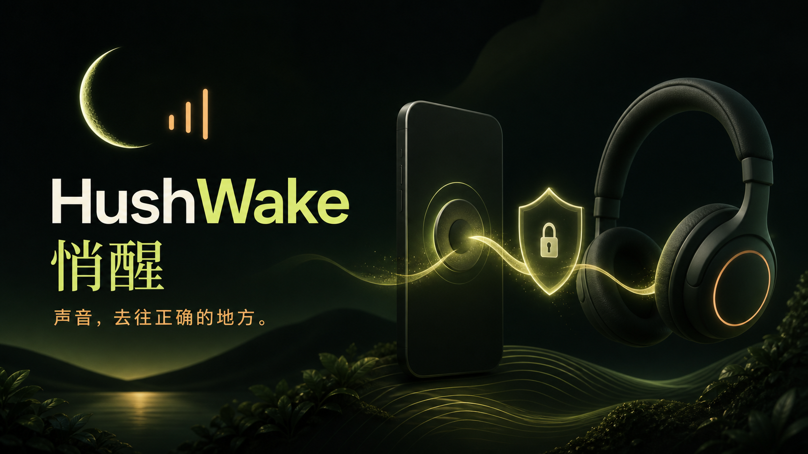

# HushWake

> Sound, routed where it belongs.



HushWake is a safety-first Android alarm and sleep-sound app. When no headphones are present, it can use normal media output. When headphones are detected, it enters a guarded path: playback starts muted, the current device and actual audio route must pass validation, and any disconnect or uncertainty mutes and stops playback instead of falling back to a speaker.

The project is currently `0.3.3-beta` for Android 12 / API 31 and newer. It is open for source review and collaboration, but it is **not yet a publicly validated stable release**. Real-device, zero-speaker-leakage testing remains a release gate.

## What makes it different

- Fail-closed headphone playback: uncertainty means silence, not speaker fallback.
- Actual-route checks are kept separate from Android's preferred-device hint.
- Alarm scheduling, reboot/time-change recovery, lock-screen entry, snooze and vibration fallback.
- Six redistributable ambient recordings and six AOSP alarm sounds, all available offline.
- Local-first data, no account, no analytics upload, and no cloud sync.
- Per-install salted hashes are used for locally remembered headphone verification; raw names and addresses are not persisted.

## Build

You need JDK 17 and Android SDK 36.

```powershell
.\gradlew.bat :app:testDebugUnitTest :app:lintDebug :app:assembleDebug
```

The debug APK is generated at `app/build/outputs/apk/debug/app-debug.apk`.

## Contributing

Route-safety bugs, device compatibility reports, tests and focused UX improvements are especially welcome. Please read [CONTRIBUTING.md](../CONTRIBUTING.md) and the [real-device test guide](device-test-guide.md) first. Never weaken the headphone guard or enable silent speaker fallback merely to make a test pass.

The primary project documentation is currently maintained in Chinese. Issues and pull requests are welcome in either Chinese or English.

## License

HushWake source code is licensed under the [Apache License 2.0](../LICENSE). Bundled audio assets retain their own licenses; see [audio credits and third-party notices](audio-credits.md).

[返回中文 README](../README.md)
