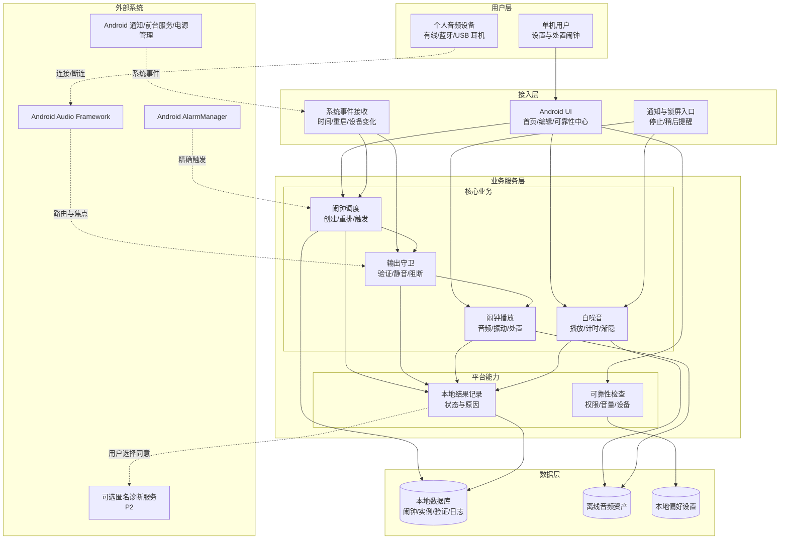
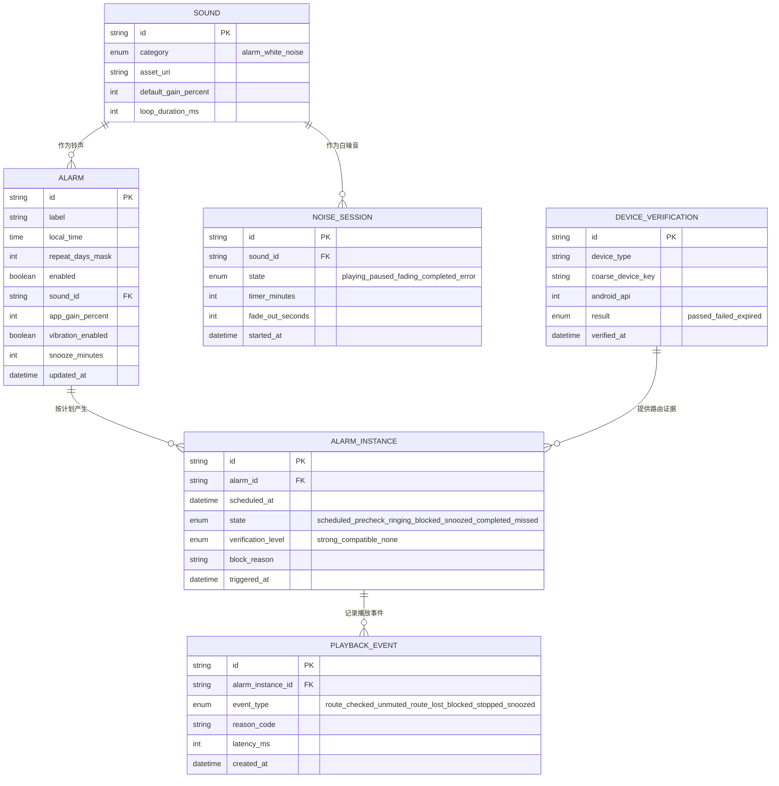
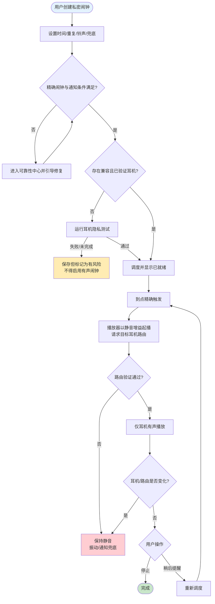
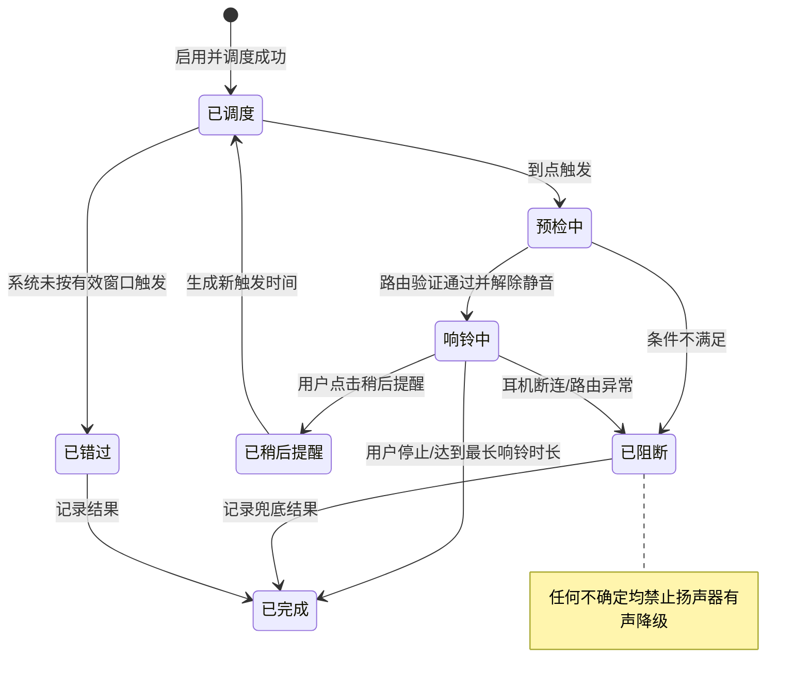
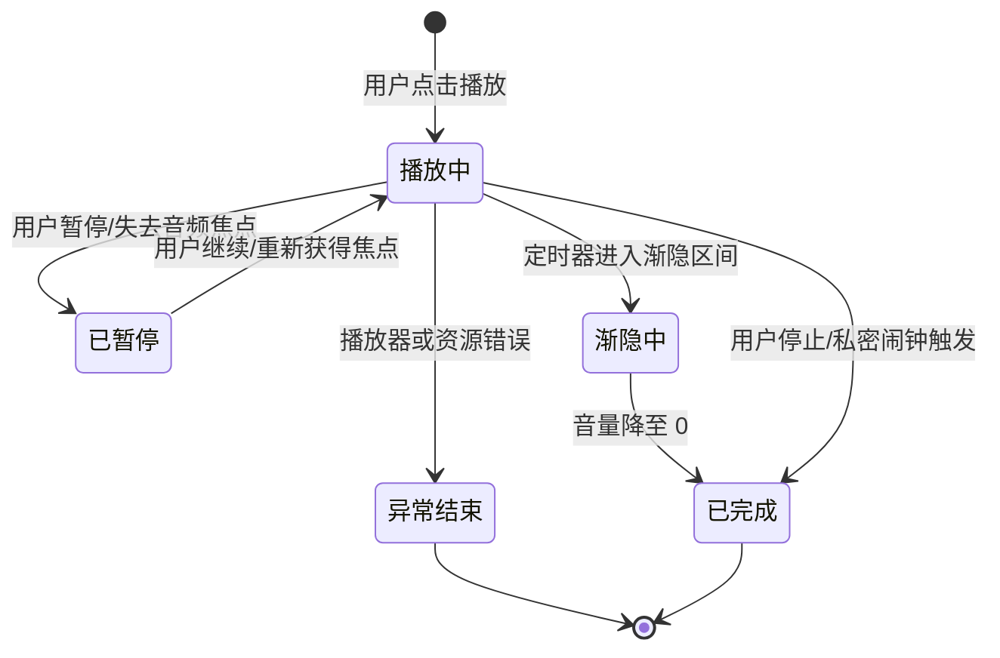

# HushWake（悄醒）Android App PRD

> 产品英文名：HushWake；中文名：悄醒。核心定位：一款在公共或共享空间中优先保护隐私、仅在耳机输出已验证时才播放声音，并提供白噪音助眠的个人 Android 工具。

| PRD 审核人 | [TODO: 待填写] |
| --- | --- |
| 重要性 | 高 |
| 紧迫性 | 中 |
| 需求方 | 产品发起人本人 |
| PRD 编写人 | Codex（根据产品发起人需求整理） |
| PRD 提交日期 | 2026-08-11 |
| 产品阶段 | 0–1 MVP |
| 当前商业属性 | 非商业化；个人使用并免费分享 |

## PRD 修改记录

| 变更时间 | 变更内容 | 变更提出部门与理由 | 修改人 | 审核人 | 版本号 |
| --- | --- | --- | --- | --- | --- |
| 2026-08-11 | 初始版本 | 将“耳机私密闹钟 + 白噪音助眠”整理为可研发评审的 0–1 PRD | Codex | [TODO: 待填写] | v1.0 |
| 2026-08-11 | 增加首个技术验证版边界 | 初始化 Android 工程，交付静音起播、实际路由验证和断连失败静音实验室 | Codex | [TODO: 待实体机验证] | v1.1 |
| 2026-08-12 | 修复 Android 14 启动崩溃 | 在标准 API 34 设备复现并修正内容视图建立前访问系统栏控制器的问题 | Codex | 已通过 API 34 冷启动回归 | v1.2 |

---

## 1、项目背景

### 1.1 使用现状

用户在宿舍、办公室午休、图书馆、长途交通工具、多人共享房间等场景中，既需要定时唤醒，又不希望闹钟通过手机扬声器打扰他人。系统闹钟通常以“确保叫醒”为最高优先级，无法把“绝不外放”作为可理解、可验证的产品承诺。

同一批用户在入睡前也可能使用雨声、风扇声等连续环境音隔离噪声。若闹钟与白噪音分属两个应用，用户需要分别设置音频、定时和输出设备，且两者在闹钟触发时可能争抢音频焦点。

### 1.2 面临问题

1. **外放打扰风险（P0）**：耳机未连接、蓝牙中断或系统重新路由时，闹钟可能转到扬声器。
2. **“设好了但未必会响”的不确定性（P0）**：精确闹钟权限、媒体音量、电池限制、应用被强制停止等系统状态会影响唤醒可靠性。
3. **睡眠音频体验割裂（P1）**：白噪音与闹钟缺少统一的定时、音量、音频焦点和冲突处理。
4. **现有方案难以被普通用户验证（P1）**：用户通常看不到实际输出设备、权限健康度和下一次闹钟是否已成功调度。

### 1.3 解决思路

产品采用两条不可交换的优先级：**隐私安全 > 有声唤醒可靠性**。只有当兼容耳机已连接、输出路由通过验证、媒体音量可用时，才允许闹钟声音解除静音；任何不确定状态均保持静音，并用可选振动和通知兜底，不自动切换到扬声器。

围绕该原则，产品提供：私密闹钟、触发前环境检查、耳机断连立即静音、测试闹钟、白噪音离线播放、睡眠定时器，以及面向 Android 系统权限和后台限制的可靠性中心。

### 1.4 决策依据

- Android 精确闹钟属于受管理能力，应用需要符合相应用例并检查权限状态；权限被撤销后，未来精确闹钟可能被取消。
- Android 的 `setPreferredDevice()` 表达的是“首选输出设备”，官方文档明确说明首选设备不保证等于实际路由设备。因此产品不能仅凭 API 调用成功就宣称“绝不外放”。
- Android 16（API 36）开始可以枚举单个播放轨的全部实际路由设备；较旧版本只能获得较弱的路由证据，需要辅以用户隐私测试与兼容性分级。
- 用户已确认当前不考虑商业化，首版不设计支付、订阅、广告、账号体系或云同步。

> 💡 方法论提示：本章按“场景事实 → 影响优先级 → 产品原则”收敛立项理由，不用未来商业化假设替代当前用户问题。

## 2、需求基本情况

| 要素 | 内容 |
| --- | --- |
| **需求提出人** | 产品发起人本人 |
| **功能使用人** | 在公共、共享或安静环境中需要被私密唤醒的 Android 用户；使用白噪音辅助入睡的用户 |
| **受影响人** | 同住者、同事、乘客等附近人群 |
| **发生频率** | 闹钟通常每日 1–3 次；白噪音通常每晚 1 次（均为产品假设，待验证） |
| **核心痛点** | 用户需要被声音唤醒，但不能承担声音意外从扬声器播放的社交风险 |
| **需求价值** | 让用户在明确知道兼容边界和兜底结果的前提下，放心设置私密闹钟并减少助眠工具切换 |

### 2.1 核心用户画像

| 用户类型 | 典型环境 | 首要诉求 | 主要顾虑 |
| --- | --- | --- | --- |
| 午休用户 | 开放办公室、会议室 | 到点醒来且不打扰同事 | 蓝牙耳机休眠或断连 |
| 共享居住用户 | 宿舍、合租房、伴侣同住 | 不同作息下私密唤醒 | 闹钟外放、振动过强 |
| 旅途用户 | 火车、飞机候机区、休息室 | 短时休息后按时醒来 | 系统省电、耳机电量不足 |
| 睡眠辅助用户 | 卧室 | 用连续环境音入睡 | 白噪音与闹钟冲突、整夜耗电 |

### 2.2 核心场景描述

**场景 1：办公室午休后的私密唤醒**

- **人物**：佩戴蓝牙耳机午休的上班族。
- **时间**：工作日午间，30–60 分钟短睡。
- **地点**：开放办公区。
- **起因**：用户需要在下午会议前醒来，但办公室要求安静。
- **经过**：用户创建 13:55 的私密闹钟，应用完成权限、耳机、媒体音量与隐私测试检查；到点仅在已验证耳机中播放。
- **结果**：连接有效时耳机响铃；若耳机断开，应用保持扬声器静音并以用户预先启用的振动、通知兜底。

**场景 2：白噪音入睡后被唤醒**

- **人物**：合租环境中容易被背景噪声影响的用户。
- **时间**：夜间入睡至次日清晨。
- **地点**：共享卧室。
- **起因**：用户希望用雨声助眠，并在设定时间私密唤醒。
- **经过**：用户启动白噪音并设置 45 分钟渐隐；次日闹钟触发时，应用结束残留白噪音会话并执行私密输出验证。
- **结果**：音频会话不冲突，闹钟遵循“验证后才发声”的隐私规则。

**场景 3：耳机在闹钟播放期间意外断开**

- **人物**：使用低电量蓝牙耳机的旅途用户。
- **时间**：闹钟正在响铃时。
- **地点**：安静车厢。
- **起因**：蓝牙耳机掉电或离开连接范围。
- **经过**：应用收到设备或路由变化事件，先将应用播放器增益立即降为 0，再停止有声播放。
- **结果**：应用不主动迁移到扬声器，进入“输出已阻断”状态，并按设置振动、展示全屏提醒或通知。

> 💡 方法论提示：场景覆盖正常路径、跨模块路径和最关键的异常路径；核心价值必须在异常时仍成立。

## 3、产品机会与同类方案分析

> 本产品当前为非商业化个人工具，本章不做市场规模、营收或付费模型分析，重点验证问题是否真实、方案是否有差异。

### 3.1 同类方案调研

| 方案类型 | 典型能力 | 可借鉴点 | 主要局限 | 本产品取舍 |
| --- | --- | --- | --- | --- |
| Android 系统闹钟 | 精确唤醒、重复、稍后提醒 | 闹钟基本交互成熟、系统级可靠性强 | 通常以“确保有声提醒”为优先，未向用户提供私密路由验证闭环 | 保留熟悉的设闹钟体验，把输出隐私作为核心状态 |
| 通用音乐/白噪音 App | 连续播放、定时关闭、声音库 | 助眠体验和音频控制成熟 | 通常不负责精确唤醒和断连后的私密兜底 | 与私密闹钟共用播放策略和冲突规则 |
| 第三方增强闹钟 | 自定义铃声、任务解锁、睡眠追踪 | 唤醒方式丰富 | 功能复杂，且“只在耳机播放”常缺少可验证承诺 | 首版保持单一问题域，不加入任务解锁和睡眠评分 |
| 手工方案：系统闹钟 + 连接耳机 | 无需安装新应用 | 使用成本低 | 结果依赖系统/厂商路由，断连后可能改走扬声器 | 用环境检查、隐私测试、失败静音降低不确定性 |

### 3.2 痛点优先级

| 排序 | 痛点 | 影响范围 | 严重程度 | 紧迫度 |
| --- | --- | --- | --- | --- |
| 1 | 耳机断连后声音转到扬声器 | 所有私密闹钟用户 | 高 | 高 |
| 2 | 用户误以为“已设置”就一定满足输出条件 | 所有新用户 | 高 | 高 |
| 3 | 系统权限或省电策略导致未按时触发 | 部分系统/厂商设备 | 高 | 高 |
| 4 | 白噪音与闹钟音频焦点冲突 | 同时使用两项功能的用户 | 中 | 中 |
| 5 | 为小功能安装复杂睡眠应用 | 追求简洁的用户 | 中 | 低 |

### 3.3 产品定位

**一句话定位**：为公共或共享空间中的 Android 用户提供“输出不确定就不发声”的私密闹钟，并用轻量白噪音完成入睡到唤醒的基本闭环。

**差异化原则**：不是承诺在所有 Android 设备上都能响，而是清楚显示当前是否满足私密播放条件；在隐私与叫醒发生冲突时，始终选择不外放。

### 3.4 当前价值与未来可能性

| 阶段 | 价值目标 | 明确不做 |
| --- | --- | --- |
| 当前：个人与小范围分享 | 验证私密输出是否解决真实问题，积累兼容性样本 | 收费、广告、会员、账号、增长 SDK |
| 形成稳定口碑后 | 评估更丰富声音库、跨设备、公益赞助或可选高级能力 | 未经验证不预设订阅模式 |

## 4、项目收益目标

### 4.1 项目目标

| 目标类型 | 目标描述 | 衡量指标 | MVP 建议目标值 | 达成时限 |
| --- | --- | --- | --- | --- |
| **隐私目标** | 已进入可播放状态的私密闹钟不由应用主动输出至扬声器 | 受控设备测试中的扬声器误播次数 | 0 次 | 发布前测试周期 |
| **可靠性目标** | 满足权限、设备、音量和系统条件时按时触发 | 合格环境下触发成功率 | ≥ 99%；触发延迟 P95 ≤ 3 秒 | 小范围测试满 30 天 |
| **容错目标** | 耳机缺失或断连时快速阻断声音 | 断连检测至播放器静音耗时 | P95 ≤ 300 ms；扬声器持续播放为 0 次 | 发布前测试周期 |
| **效率目标** | 新用户能快速完成首个可用私密闹钟 | 从首次打开到通过测试并创建闹钟的中位耗时 | ≤ 3 分钟 | 小范围测试满 30 天 |
| **体验目标** | 白噪音和闹钟形成无冲突闭环 | 有效播放会话异常中断率 | < 1% | 小范围测试满 30 天 |

> [TODO: 以上数值为首版建议门槛，需结合真实设备测试能力确认，尤其是断连静音延迟。]

### 4.2 交付验收标准

1. 用户可创建、编辑、启停、删除单次或按周重复的私密闹钟。
2. 闹钟到点时，仅在已连接且已验证的兼容耳机路径上解除播放器静音；验证失败时不播放有声闹钟。
3. 有声播放期间耳机断连或路由异常时，应用先静音再停止，并按设置进入振动/通知兜底。
4. 应用可检测并引导处理精确闹钟权限、通知权限、媒体音量为零、耳机缺失、重启后未重排等问题。
5. 用户可运行 1 分钟测试闹钟和耳机隐私测试，测试结果会影响正式闹钟能否进入“已就绪”。
6. 用户可离线播放内置白噪音、设置睡眠定时器和渐隐，并能从通知控制暂停或停止。
7. 在支持范围内完成 Android 版本 × 有线/蓝牙/USB 耳机 × 锁屏/Doze/重启的测试矩阵。
8. MVP 不需要注册账号；核心数据留在本机；默认不上传行为数据和设备标识。

### 4.3 上线成功标准

小范围免费分享后连续 30 天同时满足以下条件，视为 MVP 假设成立：

1. 至少 10 名外部体验者、累计 300 次有效私密闹钟触发，且无经复现确认的应用扬声器误播。
2. 合格环境下闹钟触发成功率达到 99%，因环境不合格而阻断的闹钟均留下用户可理解的原因记录。
3. 70% 以上完成首次安装的用户成功通过隐私测试并创建至少 1 个闹钟。
4. 至少 30% 的闹钟用户尝试白噪音，作为两项能力共存价值的探索指标，不作为 P0 成败条件。

> 💡 方法论提示：交付验收检查“做没做对”，成功标准检查“是否真的有用”；免费产品不以收入指标替代使用结果。

## 5、项目方案概述

### 5.1 核心功能概述

| 序号 | 功能模块 | 功能简述 | 优先级 |
| --- | --- | --- | --- |
| 1 | 私密闹钟管理 | 创建、重复、标签、铃声、音量、振动、稍后提醒 | P0 |
| 2 | 私密输出守卫 | 识别兼容耳机、验证实际路由、断连立即静音、禁止自动外放 | P0 |
| 3 | 可靠性中心 | 汇总精确闹钟、通知、媒体音量、设备验证和测试闹钟状态 | P0 |
| 4 | 闹钟触发与处置 | 锁屏触发、停止、稍后提醒、阻断原因展示 | P0 |
| 5 | 白噪音 | 离线声音播放、定时关闭、渐入渐出、通知控制 | P1 |
| 6 | 本地设置与记录 | 默认参数、最近触发结果、隐私与数据设置 | P1 |
| 7 | 可选匿名诊断 | 用户主动同意后上传不含内容和精确闹钟时间的诊断信息 | P2 |

### 5.2 方案概述

- **产品方案**：用“已就绪 / 有风险 / 已阻断”三态取代模糊的“已设置”，所有有声路径遵循失败静音原则。
- **技术方案**：本地优先；精确调度负责准时触发，独立播放会话负责音频；通过首选设备、路由回调、实际路由检查和静音起播组成输出守卫。
- **分享方案**：先自测，再通过受控的小范围安装包或测试渠道分享；兼容性证据足够后再决定公开分发渠道。

### 5.3 MVP 范围

**MVP 包含：**

- 单次/重复闹钟、一个铃声或少量内置铃声、振动、停止、一次稍后提醒。
- 有线、蓝牙 A2DP 和 USB 耳机检测；不支持仅通话通道的蓝牙设备。
- 隐私测试、1 分钟测试闹钟、环境健康检查、失败静音、断连阻断。
- 3–5 个离线白噪音、15/30/45/60 分钟及自定义计时、5–30 秒渐隐。
- 最近 30 条触发结果和失败原因，仅本地保存。

**MVP 暂不包含：**

- iOS、Wear OS、桌面端、跨设备同步。
- 睡眠监测、录音、打鼾识别、智能唤醒时间窗。
- 在线声音商城、用户上传音频、社区、账号与云备份。
- 付费、订阅、广告、推广裂变。
- 强制绕过系统静音或自动修改系统媒体音量。

**核心验证假设：**

1. 用户愿意用“有声失败时改为静音兜底”交换不外放的确定性。
2. 一次性的隐私测试和日常健康检查不会造成过高设置成本。
3. 轻量白噪音能提升产品复用，而不会稀释私密闹钟的核心定位。

### 5.4 当前交付：0.1.1-lab 技术验证版

当前仓库已实现一个可安装的实体机验证切片，范围严格小于上述 MVP：

- 只验证当前输出设备、静音起播、实际路由、低增益测试音、路由变化和本地诊断。
- API 36+ 使用播放轨全部实际路由作为强验证证据；API 31–35 仅显示为兼容验证并要求人工确认听感。
- 蓝牙 A2DP 类型无法单靠系统类型证明是耳机而非音箱，因此起播前要求用户确认当前唯一候选设备为本人佩戴的耳机。
- 不包含正式闹钟调度、锁屏响铃、振动兜底、白噪音或发布渠道；不得以此版本宣称 MVP 已完成。
- 实体机验证步骤和停止条件以 `docs/device-test-guide.md` 为准。

## 6、项目范围

### 6.1 涉及系统

| 系统/组件 | 关系类型 | 影响描述 | 责任方 |
| --- | --- | --- | --- |
| HushWake Android App | 主体 | 新建原生 Android 应用 | 产品/开发者 |
| Android AlarmManager | 系统调度 | 精确闹钟、休眠唤醒、权限状态 | Android 系统 |
| Android 音频框架 | 输出依赖 | 音频焦点、设备路由、播放、断连事件 | Android 系统/设备厂商 |
| Android 通知与前台服务 | 系统接入 | 锁屏提示、白噪音后台播放、播放控制 | Android 系统 |
| 本地数据库/偏好存储 | 数据层 | 保存闹钟、设置、设备验证和结果日志 | App |
| 可选诊断服务 | P2 外部系统 | 经同意后接收匿名兼容性信息 | [TODO: 是否建设] |

### 6.2 影响范围

- **用户影响**：用户需要授予精确闹钟和通知相关权限，并理解“耳机不可用时不会外放，也可能没有声音”。
- **流程影响**：首次创建前增加可靠性引导和隐私测试；每个启用闹钟都展示就绪状态。
- **数据影响**：首版仅新增本地数据，无旧数据迁移；卸载应用会删除所有闹钟和记录。
- **系统影响**：受 Android 版本、厂商后台策略、蓝牙栈和耳机固件影响，需设备兼容性测试。

### 6.3 本期不做范围

1. 不承诺应用被用户“强制停止”、系统故障、关机或设备无电后仍能触发。
2. 不承诺在未完成隐私测试或应用无法验证输出路径时播放声音。
3. 不将手机扬声器作为私密闹钟的任何自动降级路径。
4. 不提供医疗、失眠治疗或保证唤醒等健康声明。
5. 不采集麦克风、位置、联系人、短信等与核心功能无关的权限或数据。
6. 不在 MVP 内解决所有厂商机型；未验证组合必须显示兼容性等级。

## 7、项目风险

### 7.1 前提假设

| 编号 | 假设内容 | 假设不成立的影响 |
| --- | --- | --- |
| A1 | 用户接受“耳机不可用时宁可无声，也不外放” | 核心定位不成立，需要引入可选普通闹钟模式但会削弱品牌承诺 |
| A2 | 目标设备允许应用获得精确闹钟能力并按政策发布 | 只能提供近似触发，不适合作为闹钟产品 |
| A3 | 用户会在正式使用前完成一次设备隐私测试 | 旧版 Android 上缺少足够的路由可信度，正式闹钟需保持阻断 |
| A4 | 小范围用户以 Android 12 及以上为主 | 若旧系统占比高，兼容成本和风险显著上升 |

### 7.2 约束条件

| 编号 | 约束描述 | 对设计的影响 |
| --- | --- | --- |
| C1 | `setPreferredDevice()` 不保证实际输出设备 | 必须静音起播、检查实际路由、监听变化并失败静音 |
| C2 | Android 15 及以下无法对单播放轨枚举所有实际输出设备 | 采用兼容隐私模式，并要求人工隐私测试；文案不得声称系统级绝对保证 |
| C3 | 精确闹钟和前台服务受系统版本与分发政策约束 | 上架前复核权限声明和商店政策，运行时持续检查权限 |
| C4 | 应用不应悄悄修改系统音量 | 设置流程必须显式检查媒体音量并由用户调整 |
| C5 | 本地优先且无账号 | 无跨设备恢复；需要明确导出/备份不在 MVP |

### 7.3 风险清单

| 编号 | 风险类别 | 风险描述 | 概率 | 影响 | 应对方案 |
| --- | --- | --- | --- | --- | --- |
| R1 | 技术 | 部分厂商忽略首选路由或同时输出到多个设备 | 中 | 高 | API 36+ 枚举全部路由；旧版要求设备测试；不确定即静音；建立兼容清单 |
| R2 | 技术 | 蓝牙断连事件与扬声器重路由存在竞态 | 中 | 高 | 播放期间持续监听；路由变化先将播放器增益置 0，再判定；受控设备实测 P95 |
| R3 | 技术 | 精确闹钟权限被撤销、重启后未恢复或厂商杀后台 | 中 | 高 | 启用时/启动时/权限变化时重排；接收开机事件；可靠性中心和测试闹钟 |
| R4 | 产品 | 用户把“私密”误解为任何设备上 100% 系统级保证 | 中 | 高 | 分级标识“强验证/兼容验证/不可用”；首次确认关键取舍；禁止绝对化营销文案 |
| R5 | 产品 | 振动兜底也会在安静环境打扰他人 | 中 | 中 | 振动默认由用户明确选择；支持关闭；阻断时只显示通知也可 |
| R6 | 体验 | 白噪音整夜播放造成耗电或耳部不适 | 中 | 中 | 默认建议定时关闭、渐隐、音量提示；不做医疗功效承诺 |
| R7 | 分发/合规 | 精确闹钟、前台服务声明不符合商店政策 | 中 | 高 | 上架前按目标商店最新政策复核；保留非商店小范围测试方案 |
| R8 | 隐私 | 为兼容诊断采集过多设备标识或精确作息 | 低 | 高 | 默认本地；诊断独立同意；只采集粗粒度系统/设备能力，不上传精确闹钟时间 |

## 8、术语和缩略语

| 术语/缩略语 | 全称 | 定义说明 |
| --- | --- | --- |
| 私密闹钟 | Private Alarm | 仅当个人音频输出路径验证成功时才有声播放的闹钟 |
| 失败静音 | Fail-closed Audio | 无法证明输出安全时默认不发声，而不是退回扬声器 |
| 输出守卫 | Output Guard | 在起播和播放期间持续检查设备与路由、控制是否解除静音的机制 |
| 隐私测试 | Privacy Test | 用户通过测试音确认特定设备/系统组合只在耳机中播放的校验流程 |
| 强验证 | Strong Verification | 系统能枚举全部实际路由且均属于允许的个人音频设备 |
| 兼容验证 | Compatibility Verification | 系统证据不完整，结合首选路由、单路由信息、设备事件和人工测试形成的较弱保证 |
| 精确闹钟 | Exact Alarm | Android 在用户指定时间触发的高时效调度能力 |
| A2DP | Advanced Audio Distribution Profile | 蓝牙高质量媒体音频协议，本产品蓝牙耳机的主要支持类型 |
| Doze | Android Doze Mode | Android 的设备空闲省电机制 |
| P95 | 95th Percentile | 95% 样本不超过该值的性能分位数 |

## 9、参考文献和引用文档

| 文档名称 | 版本/更新 | 链接 | 用途 |
| --- | --- | --- | --- |
| Android Developers：Schedule alarms | 访问于 2026-08-11 | https://developer.android.com/develop/background-work/services/alarms | 精确闹钟权限、调度和恢复约束 |
| Android Developers：Android 14 exact alarm changes | 更新于 2026-03-03 | https://developer.android.com/about/versions/14/changes/schedule-exact-alarms | 权限默认状态和闹钟类应用适用性 |
| Android Developers：AudioTrack API | 访问于 2026-08-11 | https://developer.android.com/reference/android/media/AudioTrack.html | 首选设备与实际路由能力边界 |
| Android Developers：AudioRouting API | 访问于 2026-08-11 | https://developer.android.com/reference/android/media/AudioRouting | 路由变化监听与首选设备说明 |
| Android Developers：Background playback with MediaSessionService | 访问于 2026-08-11 | https://developer.android.com/media/media3/session/background-playback | 白噪音后台播放与前台服务 |
| Android Developers：Foreground service restrictions | 访问于 2026-08-11 | https://developer.android.com/develop/background-work/services/fgs/restrictions-bg-start | 后台启动和系统版本约束 |

## 10、功能需求

### 10.1 产品框架概述

#### 10.1.1 应用架构图

#### 10.1.2 简化数据模型

| 实体 | 说明 | 核心规则 |
| --- | --- | --- |
| Alarm | 用户配置的闹钟模板 | 时间、重复日或铃声变化后必须取消并重排未来实例 |
| AlarmInstance | 某次计划触发及其运行状态 | 每个计划时间最多一个有效实例；阻断必须记录原因 |
| DeviceVerification | 某类耳机与系统版本的隐私测试结果 | 系统升级、应用音频引擎升级或设备类型变化后失效 |
| NoiseSession | 一次白噪音播放会话 | 同时最多一个活跃会话 |
| PlaybackEvent | 闹钟输出守卫的本地审计事件 | 默认保留最近 30 次实例或 30 天，先到为准 |

#### 10.1.3 核心使用流程

#### 10.1.4 闹钟实例状态机

| 当前状态 | 触发事件 | 目标状态 | 操作角色 | 前置条件 | 后置影响 |
| --- | --- | --- | --- | --- | --- |
| 已调度 | 到点事件 | 预检中 | Android 系统 | 实例有效且未被替换 | 建立播放会话、增益保持 0 |
| 预检中 | 全部输出条件通过 | 响铃中 | 输出守卫 | 兼容耳机、验证记录、实际路由、音量均合格 | 解除应用播放器静音，记录验证级别 |
| 预检中 | 任一条件失败/超时 | 已阻断 | 输出守卫 | 无 | 停止有声播放，执行用户允许的振动/通知 |
| 响铃中 | 路由丢失 | 已阻断 | 输出守卫 | 收到设备或路由变化 | 先静音再停止，记录原因 |
| 响铃中 | 稍后提醒 | 已稍后提醒 | 用户 | 未超过允许次数 | 停止当前播放并生成新实例 |
| 响铃中 | 停止/超时 | 已完成 | 用户/系统 | 无 | 停止音频、振动和通知 |
| 已调度 | 超过容忍窗口仍未触发 | 已错过 | 系统检查 | 当前时间超过计划时间 [TODO: 建议 5 分钟] | 记录 missed，不补播到扬声器 |

**状态字段可编辑性矩阵**

| 核心实体 | 状态 | 字段/操作 | 是否可见 | 是否可编辑/可触发 | 操作方 | 校验/限制 | 变更影响 | 审计 |
| --- | --- | --- | --- | --- | --- | --- | --- | --- |
| Alarm | 启用 | 时间/重复/铃声/增益/兜底 | 是 | 是 | 用户 | 保存前重新运行健康检查 | 取消旧实例并重排 | 记录配置更新时间 |
| Alarm | 启用 | 删除 | 是 | 是，需确认 | 用户 | 无 | 取消全部未来实例 | 记录删除 |
| Alarm | 停用 | 全部配置字段 | 是 | 是 | 用户 | 启用前需满足权限条件 | 不调度，启用后生成实例 | 记录配置更新时间 |
| AlarmInstance | 已调度 | 查看就绪状态 | 是 | 只读 | 用户 | 由系统实时计算 | 无 | 不记录 |
| AlarmInstance | 预检中 | 修改闹钟配置 | 否 | 否 | 用户 | 防止触发期配置竞态 | 无 | 不记录 |
| AlarmInstance | 响铃中 | 停止 | 是 | 是 | 用户 | 始终可操作 | 状态变为已完成 | 记录 stopped |
| AlarmInstance | 响铃中 | 稍后提醒 | 是 | 是 | 用户 | MVP 最多 1 次；分钟数预先设置 | 创建新实例 | 记录 snoozed |
| AlarmInstance | 已阻断 | 查看原因/打开修复 | 是 | 是 | 用户 | 不允许“强制扬声器播放” | 跳转可靠性中心 | 记录 block_reason |
| AlarmInstance | 已完成/已错过 | 修改实例 | 是 | 否，只读 | 用户 | 历史结果不可改 | 无 | 保留历史 |

#### 10.1.5 白噪音会话状态机

| 状态 | 可用操作 | 配置可编辑性 | 规则 |
| --- | --- | --- | --- |
| 播放中 | 暂停、停止、调整应用内增益、修改剩余定时 | 可编辑 | 修改声音类型时重建会话并平滑切换 |
| 已暂停 | 继续、停止、更换声音 | 可编辑 | 暂停期间定时器是否继续计时由设置决定，MVP 默认继续 |
| 渐隐中 | 停止、取消渐隐 | 除剩余定时外只读 | 取消渐隐后恢复到渐隐开始前增益 |
| 已完成/异常结束 | 重新播放 | 可编辑 | 新建会话 |

#### 10.1.6 功能清单

| 子系统 | 页面/入口 | App 端 | 锁屏/通知 | 说明 |
| --- | --- | --- | --- | --- |
| 引导 | 首次使用说明 | ✓ | — | 明确隐私优先取舍 |
| 闹钟 | 闹钟首页 | ✓ | — | 列表、启停、下一次时间、就绪状态 |
| 闹钟 | 新建/编辑闹钟 | ✓ | — | 时间、重复、铃声、增益、振动、稍后提醒 |
| 闹钟 | 响铃/阻断页面 | ✓ | ✓ | 停止、稍后提醒、阻断原因 |
| 可靠性 | 可靠性中心 | ✓ | — | 权限、设备、音量、测试、重排状态 |
| 可靠性 | 隐私测试 | ✓ | — | 测试音和人工确认 |
| 白噪音 | 白噪音播放器 | ✓ | ✓ | 声音、播放、计时、渐隐 |
| 设置 | 设置与隐私 | ✓ | — | 默认值、记录、诊断同意 |

### 10.2 产品需求详解

#### 10.2.1 首次引导与可靠性中心

##### 10.2.1.1 业务流程

首次打开 → 展示隐私原则 → 检查 Android 版本 → 说明并申请必要权限 → 检查媒体音量 → 连接耳机 → 运行隐私测试 → 创建 1 分钟测试闹钟 → 完成或带原因退出。

##### 10.2.1.2 页面交互

**可靠性中心状态项**

| 状态项 | 状态值 | 用户操作 | 通过规则 |
| --- | --- | --- | --- |
| Android 兼容级别 | 强验证/兼容验证/不支持 | 查看说明 | API 与设备能力符合支持矩阵 |
| 精确闹钟能力 | 已允许/未允许/不可用 | 打开系统设置 | `canScheduleExactAlarms()` 或等价合规能力通过 |
| 通知能力 | 已允许/未允许 | 申请/打开设置 | 可展示闹钟和播放控制通知 |
| 媒体音量 | 可用/为零/过低 | 打开系统音量面板 | 大于 0；低于建议阈值只警告 |
| 耳机连接 | 已连接/未连接/不兼容 | 刷新/查看支持类型 | 至少一个允许的输出设备 |
| 隐私测试 | 已通过/未测试/已过期/失败 | 开始测试 | 当前粗粒度设备键 + Android API 的记录有效 |
| 测试闹钟 | 已通过/未测试/失败 | 创建 1 分钟测试 | 实际完成一次符合预期的触发 |

**操作按钮**

| 按钮 | 操作说明 | 触发条件 | 结果 |
| --- | --- | --- | --- |
| 修复 | 跳转相应系统设置或说明页 | 某项未通过 | 返回 App 后自动复检 |
| 开始隐私测试 | 先静音起播并请求当前耳机路由，再播放低音量测试音 | 存在兼容耳机 | 用户确认“仅耳机听到”或报告失败 |
| 创建 1 分钟测试闹钟 | 创建一次性实例 | 核心权限已满足 | 结果写入本地记录 |
| 重新检查 | 刷新全部状态 | 始终可用 | 更新就绪状态，不更改用户系统设置 |

##### 10.2.1.3 业务规则

| 编号 | 规则类型 | 规则描述 |
| --- | --- | --- |
| ONB-R1 | 事实 | 首次引导不得用一个“全部允许”按钮掩盖各项系统权限的用途和结果 |
| ONB-R2 | 约束 | 用户未确认理解“无耳机时不会有声音”前，不得启用第一个私密闹钟 |
| ONB-R3 | 触发 | Android 大版本升级、应用音频引擎版本变化、隐私测试超过 90 天或测试设备类型变化时，验证记录过期 |
| ONB-R4 | 约束 | 隐私测试起始应用内增益 ≤ 建议最大值的 20%，用户可中止；不得自动提高系统媒体音量 |
| ONB-R5 | 推论 | 精确闹钟能力或通知能力缺失时，闹钟可保存为停用/有风险，但不能展示“已就绪” |

#### 10.2.2 私密闹钟管理

##### 10.2.2.1 业务流程

闹钟首页 → 新建/编辑 → 选择时间、重复、声音和兜底 → 保存 → 计算下一次触发时间 → 检查可靠性 → 成功调度并显示已就绪，或保存并显示具体风险。

##### 10.2.2.2 页面交互

**闹钟首页列表字段**

| 字段 | 默认值 | 类型 | 可修改 | 必显 | 说明 |
| --- | --- | --- | --- | --- | --- |
| 时间 | — | 时间 | 点击进入编辑 | 是 | 使用设备当前时区展示 |
| 重复规则 | 仅一次 | 周重复/一次 | 是 | 是 | 显示“明天/工作日/周一三五”等摘要 |
| 标签 | 空 | 文本，最多 30 字 | 是 | 否 | 无标签不占位 |
| 启用状态 | 开 | 开关 | 是 | 是 | 切换后立即调度/取消 |
| 就绪状态 | 实时计算 | 枚举 | 否 | 是 | 已就绪/有风险/已阻断 |
| 下一次触发 | 计算值 | 日期时间 | 否 | 是 | 无未来实例时显示“未调度” |

**新建/编辑字段**

| 字段 | 默认值 | 字段类型 | 必填 | 校验/说明 |
| --- | --- | --- | --- | --- |
| 时间 | 当前时间后 1 小时 | 时间 | 是 | 保存时计算下一次未来时间 |
| 重复 | 仅一次 | 星期多选 | 是 | 仅一次触发完成后自动停用 |
| 标签 | 空 | 文本 | 否 | 0–30 字，纯本地 |
| 铃声 | 默认柔和铃声 | 单选 | 是 | MVP 仅内置资产 |
| 应用内增益 | 50% | 滑杆 | 是 | 0–100%；0% 时视为无声配置并明确提示 |
| 渐强 | 15 秒 | 单选 | 是 | 0/15/30/60 秒；不改变系统音量 |
| 振动兜底 | 开启 | 开关 | 是 | 首次需解释可能打扰附近人 |
| 稍后提醒 | 5 分钟 | 单选 | 是 | MVP 允许 0 或 1 次，3/5/10 分钟 |
| 最长响铃 | 2 分钟 | 单选 | 是 | 30 秒/1/2/5 分钟 |

**操作按钮**

| 按钮 | 操作说明 | 触发条件 | 权限要求 |
| --- | --- | --- | --- |
| 保存 | 保存并重排闹钟 | 字段校验通过 | 本机用户 |
| 测试当前设置 | 立即运行 10 秒私密测试 | 兼容耳机已连接 | 本机用户 |
| 停用/启用 | 取消/建立未来调度 | 启用时权限可用 | 本机用户 |
| 删除 | 删除模板和未来实例 | 二次确认 | 本机用户 |

##### 10.2.2.3 业务规则

| 编号 | 规则类型 | 规则描述 |
| --- | --- | --- |
| ALM-R1 | 计算 | 下一次时间 = 当前时区下满足时间和重复规则的最早未来时刻 |
| ALM-R2 | 触发 | 时间、重复、启用状态或时区变化时，取消旧 PendingIntent/实例并重排 |
| ALM-R3 | 约束 | 同一闹钟在同一计划时间只能存在一个有效实例，调度标识必须稳定且唯一 |
| ALM-R4 | 约束 | 保存成功不等于已就绪；列表必须独立显示调度和隐私条件状态 |
| ALM-R5 | 触发 | 设备重启、精确闹钟权限重新授予、应用升级完成后，校验并重排全部已启用闹钟 |
| ALM-R6 | 约束 | 手动调整时间或时区后，不补播已过去的私密闹钟；记录为已错过并计算下一次 |
| ALM-R7 | 事实 | 卸载、强制停止、关机、无电属于应用无法保证的中断条件，帮助页必须明确说明 |

#### 10.2.3 私密输出守卫与闹钟触发

##### 10.2.3.1 业务流程

到点事件 → 创建播放器但增益为 0 → 枚举当前兼容耳机 → 设置首选设备 → 等待路由建立 → 检查实际路由和有效验证记录 → 通过后解除静音 → 持续监听设备/路由 → 任一异常先归零增益再停止 → 振动/通知兜底。

##### 10.2.3.2 输出验证规则

| 兼容级别 | 适用条件 | 允许有声条件 | 用户展示 |
| --- | --- | --- | --- |
| 强验证 | Android 16 / API 36+，播放轨可枚举全部实际输出 | 全部实际路由设备均为允许的个人音频输出，且至少一个与目标设备匹配 | “强验证：系统已确认全部输出” |
| 兼容验证 | Android 12–15 / API 31–35 | 首选设备设置成功；单路由信息为耳机；连接事件稳定；同组合隐私测试有效 | “兼容验证：已通过本机测试，系统能力有限” |
| 不可用 | 无兼容耳机、验证失败/过期、路由超时或系统低于支持版本 | 永不允许有声 | “已阻断：不会从扬声器播放” |

**允许的 MVP 输出类型**

| 类型 | 是否支持 | 备注 |
| --- | --- | --- |
| 有线耳机/耳麦 | 是 | 插拔必须实时监听 |
| 蓝牙 A2DP 耳机 | 是 | 需处于媒体音频连接态；仅配对不算连接 |
| USB 音频耳机 | 是 | 需通过设备隐私测试 |
| 蓝牙通话设备（仅 HFP/SCO） | 否 | MVP 不将通话路径作为闹钟媒体输出 |
| 手机扬声器/听筒 | 否 | 任何情况下都不是私密闹钟的自动输出 |
| 投屏、车机、远程播放设备 | 否 | 可能被他人听见，MVP 一律阻断 |

##### 10.2.3.3 业务规则

| 编号 | 规则类型 | 规则描述 |
| --- | --- | --- |
| OUT-R1 | 约束 | 播放器首次产生非静音采样之前必须完成本次路由验证，不能依赖上次会话状态 |
| OUT-R2 | 约束 | 任何设备断连、路由变化、播放器重建或验证超时，处理顺序必须是“应用增益归零 → 停止/暂停 → 重新判断” |
| OUT-R3 | 约束 | 不得把手机扬声器、听筒、投屏或车机作为失败后的有声降级路径 |
| OUT-R4 | 事实 | 应用内增益与系统媒体音量相乘决定最终音量；应用不得在后台自动提高系统媒体音量 |
| OUT-R5 | 触发 | 播放期间每次路由变化都重新验证；验证失败后本次实例不可自动恢复有声，除非用户在前台明确重试 |
| OUT-R6 | 约束 | 路由检查需设置超时，[TODO: 建议 1 秒]；超时等同失败，不延迟后突然外放 |
| OUT-R7 | 推论 | 同时连接多个允许耳机时，若无法证明具体目标和全部路由，则阻断并要求用户只保留一个设备 |
| OUT-R8 | 约束 | 需要抢占音频焦点时请求短时焦点；电话通话或无法安全获得焦点时保持有声阻断并执行兜底 |

#### 10.2.4 响铃、停止与稍后提醒

##### 10.2.4.1 业务流程

有声验证通过或进入静音兜底 → 展示锁屏通知/响铃页面 → 用户停止或稍后提醒 → 结束音频、振动和前台状态 → 写入结果 → 计算下一次计划。

##### 10.2.4.2 页面交互

| 页面状态 | 展示内容 | 主操作 | 次操作 |
| --- | --- | --- | --- |
| 响铃中 | 当前时间、标签、“仅耳机播放中”、验证级别 | 停止 | 稍后提醒（若可用） |
| 已阻断 | “为避免外放，本次声音已阻断”、具体原因 | 停止兜底 | 打开可靠性中心 |
| 无振动权限/能力 | 静音通知和原因 | 关闭 | 打开设置 |
| 最长响铃结束 | “本次闹钟已自动结束” | 确认 | 查看记录 |

##### 10.2.4.3 业务规则

| 编号 | 规则类型 | 规则描述 |
| --- | --- | --- |
| RNG-R1 | 触发 | 验证通过后按用户设置渐强应用内增益，不改变系统音量 |
| RNG-R2 | 约束 | 停止操作必须在锁屏通知和响铃页均可一键完成，不要求解锁后多步操作 |
| RNG-R3 | 约束 | 稍后提醒不会复用当前路由结论；再次触发时必须重新完整验证 |
| RNG-R4 | 计算 | 自动结束时间 = 实际进入响铃/阻断状态时间 + 用户设置最长时长 |
| RNG-R5 | 触发 | 白噪音仍在播放时，闹钟触发先将白噪音增益渐降至 0 并停止，再建立独立闹钟会话 |
| RNG-R6 | 约束 | 阻断原因必须使用可行动文案，例如“蓝牙耳机已断开”，不能只显示错误码 |

#### 10.2.5 白噪音

##### 10.2.5.1 业务流程

选择声音 → 设置应用内增益和定时 → 播放 → 后台/锁屏继续 → 定时进入渐隐 → 停止；若私密闹钟触发，则白噪音优先结束并让出音频焦点。

##### 10.2.5.2 页面交互

| 字段/控件 | 默认值 | 类型 | 规则 |
| --- | --- | --- | --- |
| 声音卡片 | 上次选择或雨声 | 单选 | MVP 3–5 个离线循环素材 |
| 播放/暂停 | 停止 | 按钮 | 状态即时同步到通知 |
| 应用内增益 | 30% | 滑杆 | 不改变系统媒体音量 |
| 定时器 | 30 分钟 | 单选/自定义 | 关闭、15/30/45/60 分钟或 1–480 分钟 |
| 渐隐 | 15 秒 | 单选 | 0/5/15/30 秒；在定时结束前执行 |
| 输出状态 | 跟随系统媒体输出 | 只读 | 白噪音不默认启用私密输出守卫，需明确标识当前设备 |

**操作按钮**

| 按钮 | 操作说明 | 条件 | 结果 |
| --- | --- | --- | --- |
| 播放 | 开始或继续声音 | 音频资源可用 | 启动后台媒体播放通知 |
| 暂停 | 暂停但保留会话 | 播放中 | 默认定时器继续计时 |
| 停止 | 立即结束 | 活跃会话 | 释放音频焦点和前台服务 |
| 查看输出 | 打开系统输出面板或应用说明 | 始终可用 | 用户自行选择白噪音输出 |

##### 10.2.5.3 业务规则

| 编号 | 规则类型 | 规则描述 |
| --- | --- | --- |
| NOI-R1 | 事实 | 白噪音默认遵循系统媒体输出，不继承“私密闹钟绝不外放”的强约束，页面必须持续显示当前输出类型 |
| NOI-R2 | 约束 | 音频素材需无明显循环接缝，离线可用，首版不下载远程文件 |
| NOI-R3 | 计算 | 渐隐增益按线性或听感曲线从当前应用内增益降至 0；具体曲线由听感测试确定 |
| NOI-R4 | 触发 | 收到永久音频焦点丢失、用户停止或私密闹钟事件时结束会话 |
| NOI-R5 | 约束 | 单次播放连续超过 [TODO: 建议 8 小时] 时自动停止并记录，防止误触后长期耗电 |
| NOI-R6 | 约束 | 产品文案只描述“环境音/助眠体验”，不宣称诊断、治疗失眠或改善疾病 |

#### 10.2.6 设置、记录与隐私

##### 10.2.6.1 业务流程

设置页 → 调整默认闹钟/白噪音参数 → 查看最近结果 → 清除记录或全部本地数据 → 可选开启匿名诊断 → 二次确认后生效。

##### 10.2.6.2 页面交互

| 分组 | 字段/入口 | 默认值 | 规则 |
| --- | --- | --- | --- |
| 闹钟默认值 | 增益、振动、稍后提醒、最长响铃 | 见闹钟模块 | 仅影响之后新建的闹钟 |
| 白噪音默认值 | 增益、计时、渐隐 | 30%/30 分钟/15 秒 | 仅影响新会话 |
| 记录 | 最近触发记录 | 最近 30 次 | 可查看状态、延迟、验证级别和原因 |
| 数据 | 清除记录 | — | 二次确认，不删除闹钟配置 |
| 数据 | 清除全部本地数据 | — | 二次确认，取消全部调度后删除 |
| 隐私 | 匿名诊断 | 关闭 | P2；独立同意，可随时撤回 |
| 帮助 | 兼容边界与故障排查 | — | 必须说明强制停止、关机、无电等边界 |

##### 10.2.6.3 业务规则

| 编号 | 规则类型 | 规则描述 |
| --- | --- | --- |
| SET-R1 | 约束 | 首版无账号、无云同步、无跨设备数据访问 |
| SET-R2 | 约束 | 默认不上传精确闹钟时间、标签、声音选择、蓝牙名称、稳定硬件标识 |
| SET-R3 | 触发 | 清除全部数据前先取消所有未来系统调度，避免残留触发 |
| SET-R4 | 约束 | 匿名诊断同意与通知/精确闹钟权限分开，不得捆绑 |
| SET-R5 | 计算 | 本地记录按“最近 30 次或 30 天”清理，先达到者生效 |

### 10.3 异常情况处理方案

| 异常类型 | 异常场景 | 处理方案 | 用户可见结果 |
| --- | --- | --- | --- |
| 网络异常 | 无网络 | 核心功能离线运行；不影响本地闹钟和音频 | 无需提示；诊断上传延后或放弃 |
| 权限异常 | 精确闹钟权限被拒绝或撤销 | 立即重新计算就绪状态；停止宣称已精确调度；引导系统设置 | 闹钟标记“有风险/未调度” |
| 通知异常 | 通知权限关闭 | 保留可用调度，但启用前强警告处置入口受限 | 可靠性中心红色提示 |
| 音量异常 | 系统媒体音量为 0 | 不自动调整；允许保存但不能显示有声已就绪 | “媒体音量为 0，本次将无声” |
| 设备异常 | 无耳机、仅配对未连接、连接多个不确定设备 | 保持播放器静音，振动/通知兜底 | 展示具体阻断原因 |
| 路由异常 | 首选设备设置成功但实际路由不是耳机/存在扬声器 | 立即阻断；不尝试扬声器降级 | “输出无法验证，声音已阻断” |
| 断连竞态 | 播放中耳机掉电或断连 | 第一动作将应用增益归零；停止会话；记录延迟 | 进入已阻断状态 |
| 系统时间异常 | 用户改时间、时区或夏令时 | 重新计算所有未来实例；不补播过去实例 | 展示新的下一次时间 |
| 重启异常 | 设备重启后系统调度丢失 | 开机完成后重排并记录；首次打开再次校验 | 若重排失败，可靠性中心提示 |
| 后台限制 | 厂商电池策略阻止触发 | 提供品牌无关说明和测试闹钟，不诱导过度权限 | 标记兼容风险 |
| 音频焦点冲突 | 电话、通话或其他应用独占音频 | 不强行切换通话路由；保持静音并兜底 | “当前通话占用音频” |
| 数据异常 | 本地闹钟记录损坏或调度标识冲突 | 校验隔离损坏记录；不调度；保留诊断原因 | 提示重新创建该闹钟 |
| 误操作 | 用户删除或停用闹钟 | 删除二次确认；停用支持立即撤销提示 | 明确下一次闹钟已取消 |
| 资源异常 | 白噪音资产损坏 | 停止会话并切换到错误状态；不自动播放其他声音 | 提示资源错误和重试 |
| 应用被强制停止 | 系统禁止应用继续接收事件 | 无法从应用内绕过；帮助页明确边界 | 下次打开显示可靠性警告 |

## 11、数据埋点

### 11.1 埋点策略

- **目标**：回答私密闹钟是否按时、为何被阻断、哪些设备组合不兼容、白噪音是否真正被使用。
- **隐私原则**：P0–P1 事件先写入本地；默认不联网、不上传。P2 若建设诊断服务，需用户独立同意并经过字段级隐私审查。
- **禁止采集**：精确闹钟时间、标签文本、蓝牙名称、声音内容、位置、联系人、广告 ID 或稳定硬件标识。

### 11.2 页面与行为事件

| 页面/操作 | 事件名 | 触发条件 | 本地参数 | 用途 |
| --- | --- | --- | --- | --- |
| 闹钟首页 | `alarm_home_view` | 页面打开 | alarm_count, ready_count | 判断功能激活 |
| 创建闹钟 | `alarm_created` | 保存成功 | repeat_type, fallback_vibration | 统计核心功能采用 |
| 启停闹钟 | `alarm_toggle` | 开关变化 | enabled, readiness | 分析风险状态下的决策 |
| 隐私测试 | `privacy_test_completed` | 用户给出结果 | api_bucket, device_type, result | 建立兼容证据 |
| 测试闹钟 | `test_alarm_completed` | 流程结束 | state, latency_bucket, block_reason | 验证新手流程 |
| 正式触发 | `alarm_instance_completed` | 实例终态 | state, verification_level, latency_bucket, reason_code | 可靠性和阻断分析 |
| 路由丢失 | `route_lost` | 播放中失去允许路由 | device_type, mute_latency_bucket | 验证隐私守卫 |
| 白噪音 | `noise_session_completed` | 会话结束 | sound_category, duration_bucket, end_reason | 分析助眠功能使用 |
| 可靠性中心 | `reliability_action` | 用户执行修复/复检 | item_type, before_state, after_state | 优化权限引导 |

### 11.3 核心指标

| 指标 | 计算方式 | 数据来源 | 周期 |
| --- | --- | --- | --- |
| 合格环境触发成功率 | 响铃中或正常兜底完成的实例 / 满足全部前置条件实例 | 本地实例与事件 | 日/周 |
| 扬声器误播数 | 经人工报告并复现确认的应用扬声器有声事件数 | 测试记录/反馈 | 发布门禁 |
| 阻断率 | 已阻断实例 / 全部到点实例 | AlarmInstance | 周 |
| 断连静音延迟 P95 | `route_lost` 到增益归零的延迟分位数 | PlaybackEvent | 版本 |
| 首次激活率 | 完成隐私测试且创建闹钟的用户 / 完成首次启动用户 | 本地漏斗；分享测试期可人工汇总 | 测试周期 |
| 白噪音采用率 | 使用过白噪音的闹钟用户 / 活跃闹钟用户 | 本地事件 | 测试周期 |

## 12、角色和权限

### 12.1 角色定义

| 角色 | 说明 | 权限范围 |
| --- | --- | --- |
| 本机用户 | 当前设备上的应用使用者，无需账号 | 可管理本机全部闹钟、设置、白噪音与本地记录 |
| Android 系统 | 调度、通知、音频和权限的系统执行方，不是业务用户 | 只通过声明的系统接口触发事件，不拥有应用内编辑权限 |

### 12.2 功能权限与数据范围

| 功能/数据 | 本机用户 | Android 系统 | 说明 |
| --- | --- | --- | --- |
| 创建/编辑/删除闹钟 | ✓ | — | 数据仅在应用沙箱 |
| 触发闹钟实例 | 通过配置授权 | ✓ | 系统只传递已调度事件 |
| 停止/稍后提醒 | ✓ | — | 锁屏入口需防止复杂步骤 |
| 播放白噪音 | ✓ | 维持后台服务 | 用户显式发起 |
| 查看本地触发记录 | ✓ | — | 不暴露给其他应用 |
| 清除数据 | ✓ | 卸载时执行 | 清除前取消调度 |
| 上传匿名诊断 | 仅显式同意后 | — | MVP 默认关闭 |

### 12.3 Android 权限最小化

| 权限/特殊能力 | 用途 | 申请时机 | 拒绝后的降级 |
| --- | --- | --- | --- |
| 精确闹钟能力 | 按用户指定时间触发 | 首次启用闹钟前，先解释 | 允许保存但不标记已就绪，不假装精确 |
| 通知 | 展示响铃、阻断和白噪音控制 | 使用相关功能时 | 明确警告处置入口受限 |
| 前台媒体播放 | 白噪音后台播放和可见控制 | 播放开始时由系统机制体现 | 不能在后台持续播放 |
| 开机完成事件 | 重排已启用闹钟 | 安装声明，无单独 UI 授权 | 下次启动时补检并提示 |
| 蓝牙连接相关能力（如目标 API 要求） | 判断蓝牙媒体设备是否可用 | 首次选择蓝牙耳机时 | 仅支持系统可无额外权限识别的设备或阻断 |

本产品不需要管理员、组织、跨用户数据权限或账号管理。MVP 不申请麦克风、位置、相册、联系人、短信和电话权限。

## 13、发布与反馈计划

### 13.1 分阶段发布

| 阶段 | 建议周期 | 范围 | 目标 | 停止/回滚条件 |
| --- | --- | --- | --- | --- |
| 开发自测 | 2–4 周 | 开发者自有设备和模拟环境 | 跑通调度、失败静音、断连、白噪音 | 出现任何可复现的扬声器误播即停止扩散 |
| 受控体验 | 2 周 | 3–5 名熟人、已知设备组合 | 验证引导可理解、收集兼容问题 | 关键阻断原因不可理解或触发成功率不足 |
| 小范围分享 | 4 周 | 10–30 名自愿体验者 | 验证 300 次触发与留存假设 | 出现 P0 隐私或漏响缺陷，暂停新安装包 |
| 公开免费发布 | [TODO] | 选定分发渠道 | 稳定提供免费工具 | 需先通过政策、兼容与隐私评审 |

### 13.2 测试设备矩阵

| 维度 | 最低覆盖 |
| --- | --- |
| Android 版本 | API 31–35 各至少一个代表版本；API 36+ 至少两台实体设备 |
| 厂商 | [TODO: 根据可获得设备覆盖至少 3 个主流厂商] |
| 耳机类型 | 3.5 mm/Type-C 有线、至少 3 款蓝牙 A2DP、至少 1 款 USB 音频 |
| 系统状态 | 前台、后台、锁屏、Doze、低电量、重启、改时间/时区、通知关闭、精确权限撤销 |
| 设备变化 | 到点前断连、静音起播期间断连、响铃中断连、多设备连接、耳机低电关机 |
| 音频冲突 | 白噪音、音乐、导航、来电/通话、其他闹钟 |

### 13.3 反馈与支持

- App 内提供“复制诊断摘要”，由用户主动分享；摘要只包含粗粒度系统版本、设备类型、验证级别、原因码和延迟区间。
- P0 隐私问题需保存复现步骤、系统版本、耳机类型和是否通过隐私测试；确认后立即暂停相关组合的有声能力。
- 小范围阶段每周复盘一次：误播、漏响、阻断原因、首次激活漏斗和白噪音异常。
- 版本节奏以 P0/P1 缺陷为先，不为固定周更节奏牺牲验证。

### 13.4 未来商业化评估门槛

仅当免费版本连续多个版本稳定、形成自发传播且用户主动表达更高级需求时，再单独立项评估商业化。商业化不得改变以下免费核心：失败静音、基础私密闹钟、兼容性说明和本地数据控制。

## 14、待决事项

| 编号 | 待决事项 | 涉及章节 | 建议负责人 | 建议决策时间 | 状态 |
| --- | --- | --- | --- | --- | --- |
| TBD-1 | MVP 最低 Android 版本是否采用推荐的 Android 12 / API 31 | 6、10、13 | 产品发起人 + Android 开发 | 技术预研后 | 验证中：实验版采用 API 31 |
| TBD-2 | 产品正式名称、图标和面向用户的一句话文案 | 全文 | 产品发起人 | 首次分享前 | 待讨论 |
| TBD-3 | 路由验证超时、断连静音 P95 和已错过窗口的最终阈值 | 4、10 | Android 开发 + 测试 | 原型性能测试后 | 验证中：实验版暂用 1 秒路由超时 |
| TBD-4 | 兼容验证模式是否允许正式闹钟有声，或 MVP 仅开放 API 36+ 强验证 | 5、7、10 | 产品发起人 + Android 开发 | 技术原型后 | 待实体机裁决：实验版仅开放低增益人工测试 |
| TBD-5 | 振动兜底默认开启还是首次显式选择 | 2、10 | 产品发起人 + 体验用户 | 受控体验前 | 待讨论 |
| TBD-6 | 白噪音最长连续播放时长以及暂停后定时器是否继续 | 10 | 产品发起人 | 开发前 | 待讨论 |
| TBD-7 | 首次分享和公开发布采用 Google Play、其他商店还是安装包渠道 | 6、13 | 产品发起人 | 小范围测试前 | 待讨论 |
| TBD-8 | P2 是否建设匿名诊断服务；如建设，字段、保存周期和隐私声明 | 6、11、12 | 产品发起人 + 开发 | 公开发布前 | 待讨论 |

---

## 附 A：生成后自检

### A.1 重大风险项快扫

| 风险项 | 状态 | 说明 |
| --- | --- | --- |
| R1 产品定位 | ✅ 已覆盖 | 已明确“为共享空间 Android 用户，提供失败静音的私密唤醒” |
| R2 核心业务流程 | ✅ 已覆盖 | 已覆盖创建、测试、调度、验证、播放、断连、兜底和稍后提醒 |
| R3 ER 模型缺陷 | 不适用/已简化覆盖 | 工具型产品不要求完整业务 ER，已提供实现所需核心实体关系 |
| R4 角色权限 | ✅ 已覆盖 | 单机个人工具已说明本机用户、系统边界和最小权限 |
| R5 功能致命缺口 | ⚠️ 需技术验证 | Android 15 及以下无法枚举全部实际路由，TBD-4 影响支持范围 |
| R6 需求与场景脱节 | ✅ 已覆盖 | 主流程和异常路径均围绕“不打扰附近人群”设计 |
| R7 合规风险 | ✅ 已覆盖 | 已识别精确闹钟、前台服务、隐私和健康宣称边界 |
| R8 SaaS 多租户 | 不适用 | 非 SaaS、无账号、无租户 |

### A.2 14 维度快速扫描

| 维度 | 完成度 | 需补充内容 |
| --- | --- | --- |
| 01 业务分析质量 | 中高 | 缺真实用户访谈和使用频次数据 |
| 02 产品类型适配性 | 高 | 已按非商业化个人工具调整商业章节和权限 |
| 03 产品定位合理性 | 高 | 需用体验者验证“宁可无声”取舍 |
| 04 场景分析与用户旅程 | 高 | 后续可补充无障碍用户场景 |
| 05 文档结构完整性 | 高 | 完整 14 章及自检 |
| 06 架构设计质量 | 中高 | 需技术原型验证 AlarmManager 与播放服务组合 |
| 07 数据建模质量 | 中高 | 核心实体已覆盖；开发设计时补字段类型和迁移策略 |
| 08 流程与角色设计 | 高 | 单用户权限边界清晰 |
| 09 交互设计质量 | 中高 | 已有页面字段和状态，仍需低保真原型验证 |
| 10 商业分析深度 | 不适用 | 当前无商业化目标，已替换为同类方案和未来评估门槛 |
| 11 MVP 策略与演进 | 高 | P0/P1/P2 和不做范围明确 |
| 12 异常处理与健壮性 | 高 | 覆盖权限、设备、路由、时间、重启、焦点和数据异常 |
| 13 AI 功能设计质量 | 不适用 | 产品不包含 AI |
| 14 发布方案与效果跟踪 | 中高 | 公开分发渠道和匿名诊断尚待决 |

## 附 B：待完善清单

### 🔴 必须补充（影响 PRD 可评审性）

1. **完成耳机路由技术原型**：实测静音起播、实际路由读取、断连竞态和厂商差异，用结果裁决 TBD-3、TBD-4；这是能否兑现核心价值的发布门槛。
2. **确定最低 Android 版本和“兼容验证”是否可正式有声**：它决定可覆盖用户范围、文案承诺和测试成本。
3. **建立至少一轮实体设备测试矩阵**：模拟器不能证明声音是否从真实扬声器泄漏。

### 🟡 建议补充（提升 PRD 质量）

1. 访谈 5–8 名午休、合租或旅途用户，确认振动默认值、可接受的设置成本和“宁可无声”的真实偏好。
2. 制作首次引导、闹钟列表、编辑页、可靠性中心和阻断页的低保真原型，进行一次可用性走查。
3. 确定小范围分享渠道和崩溃/反馈收集方式，避免为了诊断临时扩大数据采集。

### 🟢 可选完善（锦上添花）

1. 形成通过验证的设备兼容清单，后续在 App 内按机型/系统版本展示经验等级。
2. 为白噪音素材补充版权来源、循环听感和响度一致性验收表。
3. MVP 数据稳定后，再讨论品牌命名、公开主页和长期商业化，不提前加入收费架构。

---

> 💡 建议：先用最小 Android 音频原型验证“失败静音”链路，再进入视觉原型和完整开发；完善关键待决项后，可使用项目 `check-prd` 工作流进行正式评审。
